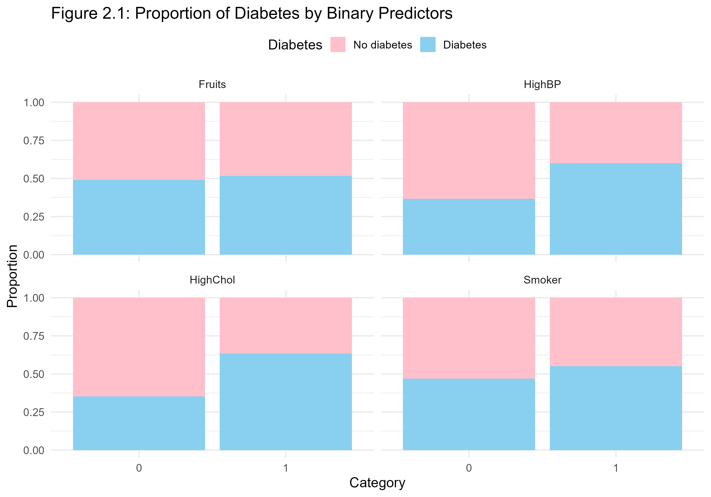
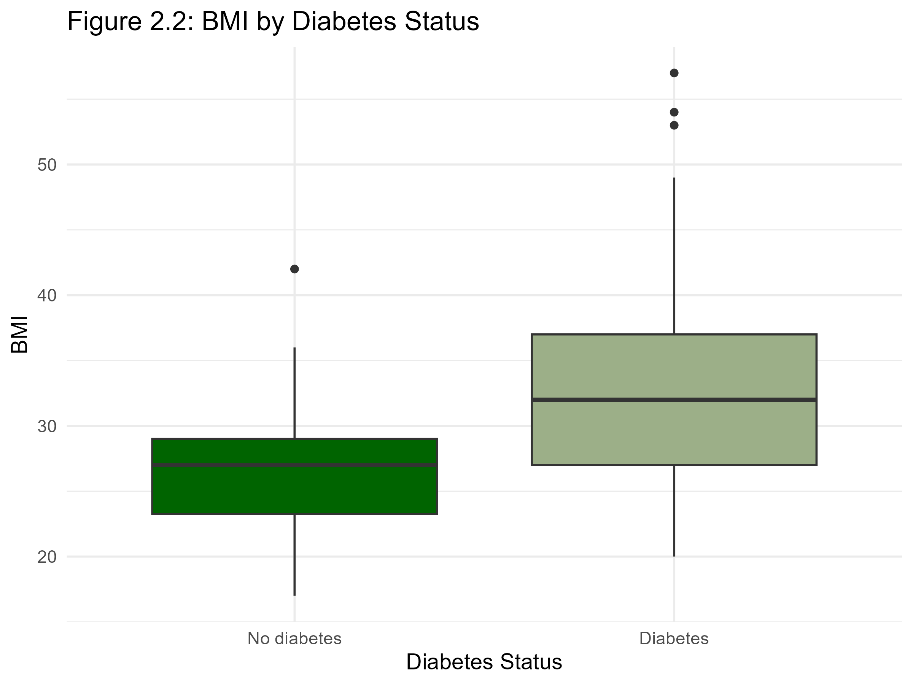
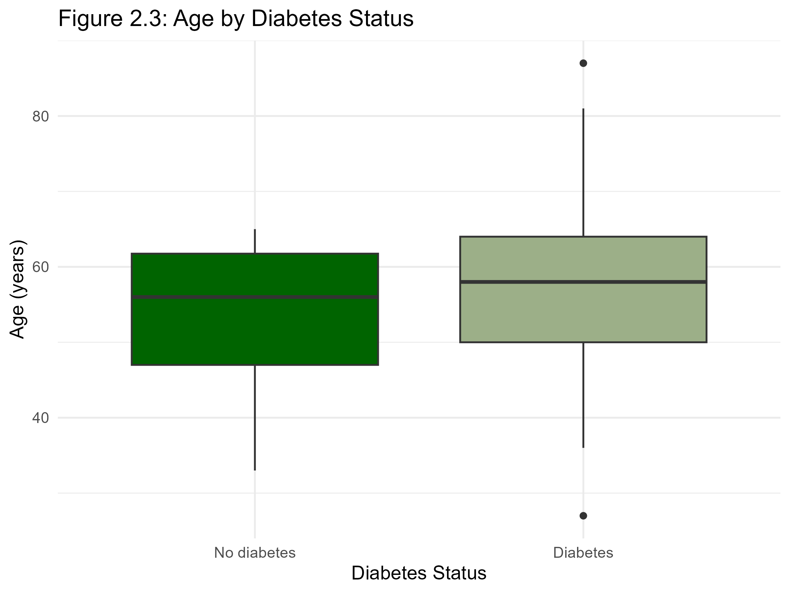

# Diabetes Risk Analysis – Health & Lifestyle

## Visualisations

### Figure 2.1: Proportion of Diabetes by Binary Predictors

### Figure 2.2: BMI by Diabetes Status

### Figure 2.3: Age by Diabetes Status

